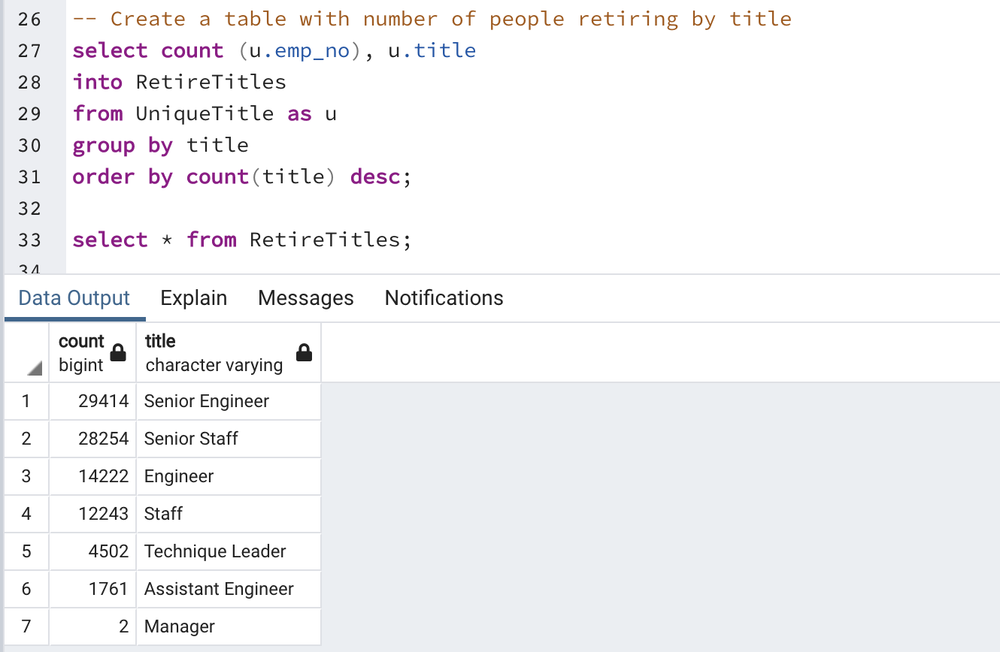
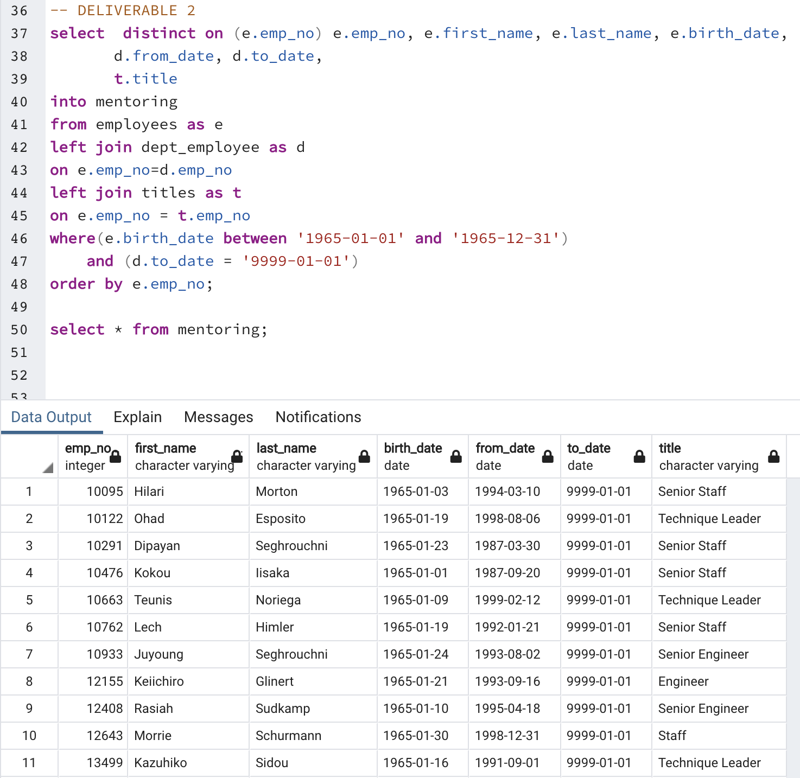
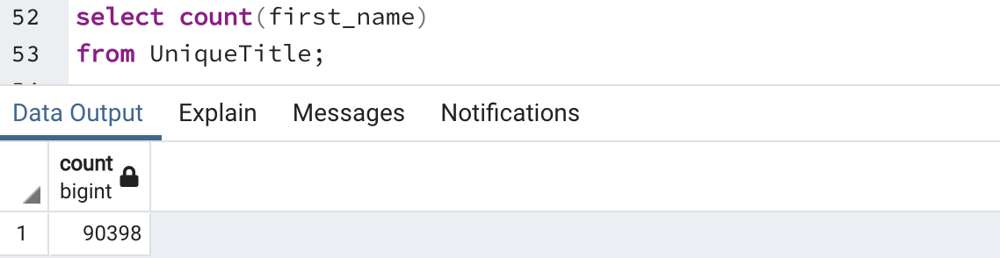
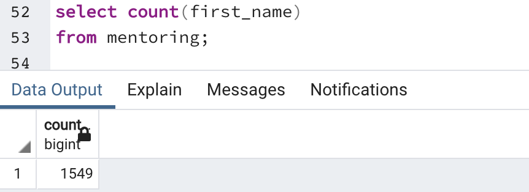
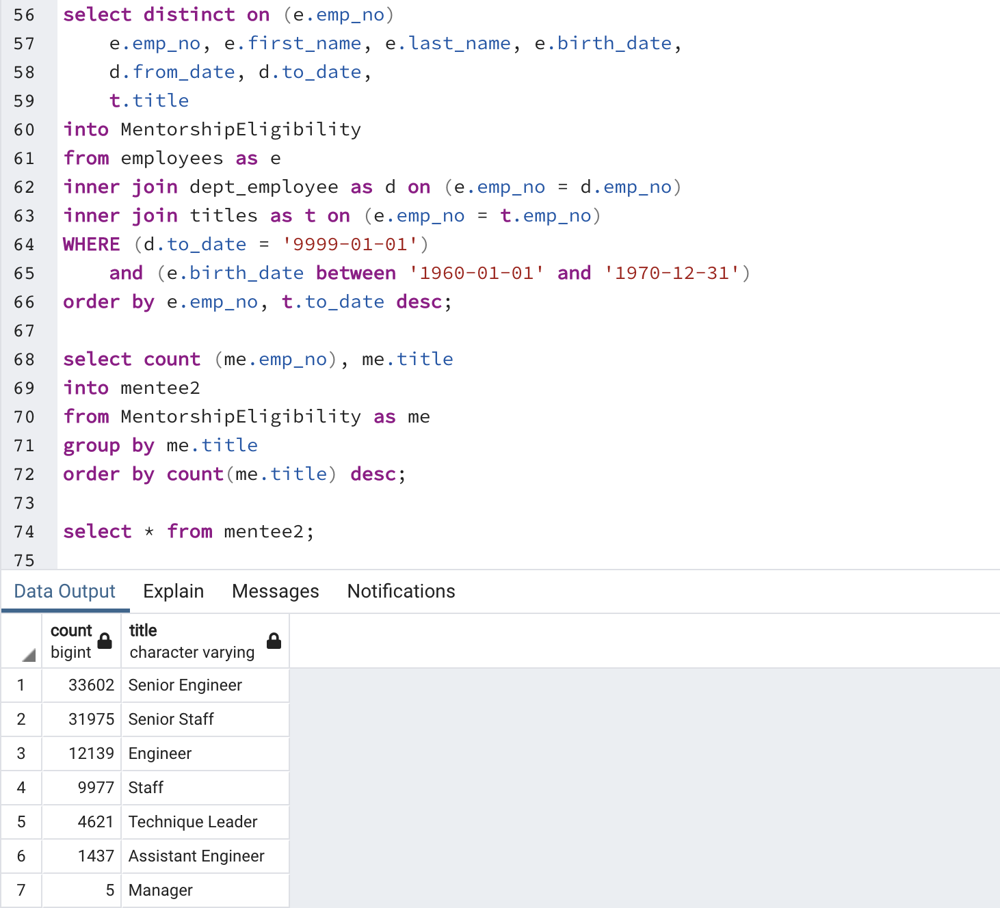
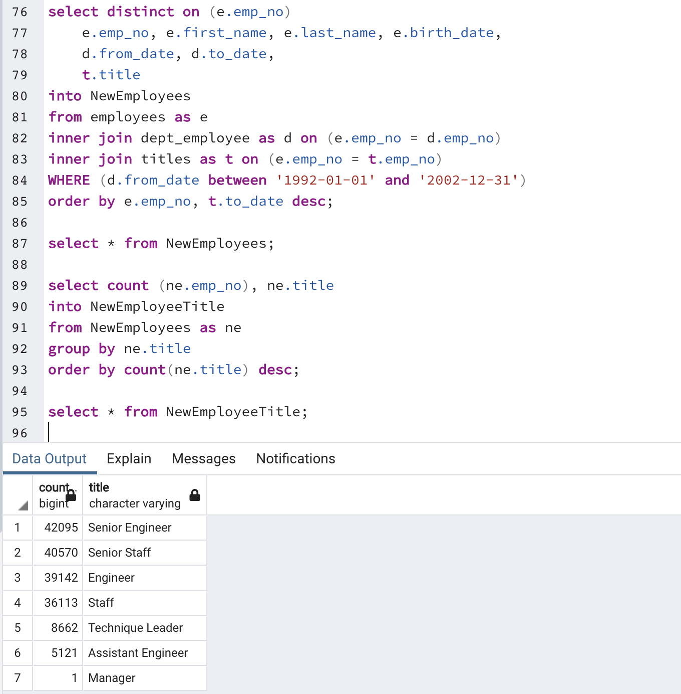

# Pewlett-Hackard-Analysis

## Overview of Analysis

This analysis was performed to provide Pewlett Hackard with better insight into the upcoming wave of retiring employees. Once the company is aware of the number of employees that are retiring, they can put in place a mentorship program to ensure that the senior roles can be filled in a timely manner with people who are prepared for the role.

To provide insight, we found the number of retiring employees by skill set and then provided a table with detail on employees that could be a part of a mentorship program.

## Results

The _RetirementTable_ table provides a list of the current employees that will be retiring. The possible retirement status was established by filtering on employees born between 1952-1955. Once this table was created, the _UniqueTitle_ table was created to filter for the latest job title held by the retiring employees. These employees were then grouped by title to better understand how many of each type of employee would be retiring.

 

Once the total number of employees retiring by title was established, a _mentoring_ table was created to understand which employees were eligible for mentorship. An employee is eligible to be mentored if he/she was born in 1965.

 

### Takeaways

- Pewlett Hackard will have employeed retiring from 7 different roles, with the majority of people retiring from the position of Senior Engineer and Senior Staff.
 

- There are a total of 90,398 employees that we predict will be retiring in the near future.
 

- There are a total of 1,547 employees that are eligible to participate in the mentoring program.
 

- From above, it is clear that there are not enough people that are eligible for the mentorship program and perhaps the criteria should be expanded to include more current employees.

## Summary

As the "silver tsunami" begins to hit, there are a total of 90,398 employees who are between 60-69 years old and are eligible for the retirement package. Hewlett Packard currently has 300,024 employees which means that approximately 30% of the workforce is eligible for retirement. 

As seen from the above tables, 57,668 of the retirement-ready employees hold either a senior engineer or senior staff position (64.8% of the retirement-ready employees). If we only allow the mentee group to be born in 1965, there are too many mentors for the number of mentees (1,547 mentees to 90,398 mentors).

However, if we increase the mentee eligibility to any employee born between 1960-1970, there are a total of 93,756 employees who are eligible to be mentored. Although this is more than the number of available mentors, one mentor may be able to take on 2 mentees in order to ensure that each mentee has a mentor.

 

In the above table, the expanded set of mentees is shown by current title. In addiion to the large number of eligible employees, there are also more employees that are already senior staff and would possibly need less mentoring than employees in more junior roles. Perhaps those employees in senior positions could be candidates for sharing mentors.

Additionally, if we take a look at the number of employees that were hired in the last 10 years, we can see that Hewlett Packard has been hiring employees at all levels to try and fill the positions as retirement-ready employees retire. There are a total of 822,665 employees that are being hired directly into senior positions. Hewlett-Packard may want to consider including these employees in a secondary mentorship program so the new employees can learn from the retirement-ready employees before leaving. New employees may also provide different ideas and improve the mentorship program so Hewlett-Packard can continue improving.

 

In the above table, the employees are filtered to include only those hired after 1992. Those employees are then grouped by title to gain visibility into the total number of "new" hires by title.